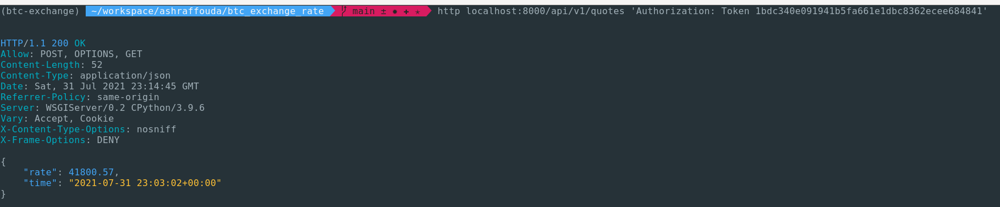

# btc_exchange_rate
this is a django project for fetching BTC/USD exchange rate
# Project Structure
The project consists of two main parts
- Django project 
    the Django part has two main functions 
    - Cron Job which fetches the exchange rate for BTC/USD from alphavantage API every hour and saves it to the postgres database
    - API Endpoints
        - `GET /api/v1/quotes` fetches the latest exchange rate save in database 
        - `POST /api/v1/quotes` which forces getting the realtime exchange rate from alphavantage API and saves it in the database
- Postgres Database
    is the database where we save our models
# Quick start 
The most easy/simple way to start is using docker-compose command
find the `.env` file and put your alphavantage token there then do
```bash
docker-compose up
```
then navigate to http://localhost:8000/admin and generate token
the default username/password are admin/admin incase you didn't change them in .env
you can use curl or http to interact with the api for example
- To do `GET /api/v1/quotes`
```bash
sudo apt-get install httpie #if you are on ubuntu
```
```bash
http localhost:8000/api/v1/quotes/ 'Authorization: Token <token>' # replace <token> with your actual token
```
you should see something like this 


- To do `POST /api/v1/quotes`
```bash
sudo apt-get install httpie #if you are on ubuntu
http POST localhost:8000/api/v1/quotes/ 'Authorization: Token <token>' # replace <token> with your actual token
```
you should see something like this 


or for sure you can use the browser to navigate to http://localhost:8000/api/v1/quotes and do the required stuff from the browser UI
## Other options for deploying
    you can build the docker image your self using the Dockerfile in the repo and do the required stuff exposing ports and stuff

# Rebuild 
In case for some reason you want to rebuild the whole stuff again from scratch
```bash
sudo rm -fr data && docker-compose up --build
```


